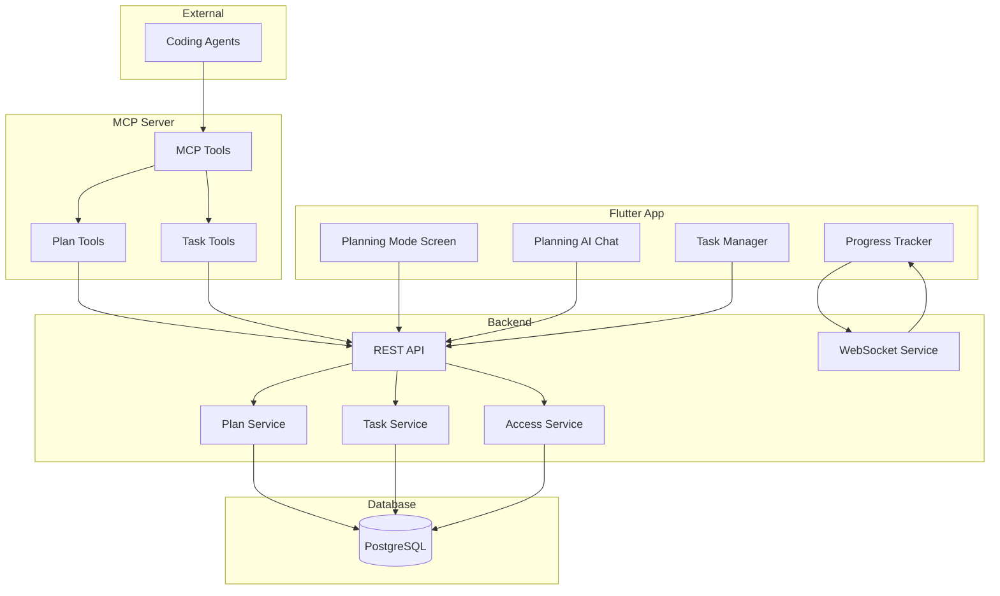

# Design Document: Planning Mode

## Overview

Planning Mode is a collaborative feature that bridges the NotebookLLM app with external coding agents. It provides a spec-driven workflow where users can brainstorm with an AI planning assistant, organize ideas into structured requirements and tasks, and track progress as coding agents execute the work via MCP.

The system consists of three main components:
1. **Flutter App UI** - Planning screens, task management, and real-time progress tracking
2. **Backend API** - Plan and task CRUD operations, access control, analytics
3. **MCP Server Extensions** - New tools for coding agents to access and update plans

## Architecture



## Components and Interfaces

### 1. Plan Model

```typescript
interface Plan {
  id: string;
  userId: string;
  title: string;
  description: string;
  status: 'draft' | 'active' | 'completed' | 'archived';
  
  // Spec-driven structure
  requirements: Requirement[];
  designNotes: DesignNote[];
  tasks: Task[];
  
  // Access control
  isPrivate: boolean;
  sharedAgents: AgentAccess[];
  
  // Metadata
  createdAt: Date;
  updatedAt: Date;
  completedAt?: Date;
}

interface Requirement {
  id: string;
  planId: string;
  title: string;
  description: string;
  earsPattern: 'ubiquitous' | 'event' | 'state' | 'unwanted' | 'optional' | 'complex';
  acceptanceCriteria: string[];
  sortOrder: number;
}

interface DesignNote {
  id: string;
  planId: string;
  requirementIds: string[];  // Links to requirements
  content: string;
  createdAt: Date;
}
```

### 2. Task Model

```typescript
interface Task {
  id: string;
  planId: string;
  parentTaskId?: string;  // For sub-tasks
  requirementIds: string[];  // Links to requirements
  
  title: string;
  description: string;
  status: TaskStatus;
  priority: 'low' | 'medium' | 'high' | 'critical';
  
  // Agent tracking
  assignedAgentId?: string;
  agentOutputs: AgentOutput[];
  timeSpentMinutes: number;
  
  // Status tracking
  statusHistory: StatusChange[];
  blockingReason?: string;
  
  // Hierarchy
  subTasks: Task[];
  
  createdAt: Date;
  updatedAt: Date;
  completedAt?: Date;
}

type TaskStatus = 'not_started' | 'in_progress' | 'paused' | 'blocked' | 'completed';

interface StatusChange {
  status: TaskStatus;
  changedAt: Date;
  changedBy: string;  // userId or agentId
  reason?: string;
}

interface AgentOutput {
  id: string;
  taskId: string;
  agentId: string;
  agentName: string;
  type: 'comment' | 'code' | 'file' | 'completion';
  content: string;
  metadata?: Record<string, any>;
  createdAt: Date;
}
```

### 3. Access Control Model

```typescript
interface AgentAccess {
  id: string;
  planId: string;
  agentSessionId: string;
  agentName: string;
  permissions: ('read' | 'update' | 'create_task')[];
  grantedAt: Date;
  revokedAt?: Date;
}
```

### 4. MCP Tools Interface

New MCP tools to be added to the existing MCP server:

```typescript
// List all accessible plans
interface ListPlansParams {
  status?: 'draft' | 'active' | 'completed' | 'archived';
  limit?: number;
  offset?: number;
}

// Get a specific plan with full details
interface GetPlanParams {
  planId: string;
  includeTasks?: boolean;
  includeRequirements?: boolean;
}

// Create a new plan
interface CreatePlanParams {
  title: string;
  description?: string;
  requirements?: CreateRequirementParams[];
}

// Create a task in a plan
interface CreateTaskParams {
  planId: string;
  parentTaskId?: string;
  title: string;
  description?: string;
  requirementIds?: string[];
  priority?: 'low' | 'medium' | 'high' | 'critical';
}

// Update task status
interface UpdateTaskStatusParams {
  taskId: string;
  status: TaskStatus;
  reason?: string;  // Required for 'blocked' status
}

// Add output to a task
interface AddTaskOutputParams {
  taskId: string;
  type: 'comment' | 'code' | 'file' | 'completion';
  content: string;
  metadata?: Record<string, any>;
}

// Complete a task
interface CompleteTaskParams {
  taskId: string;
  summary?: string;
  outputs?: AddTaskOutputParams[];
}
```

## Data Models

### Database Schema

```sql
-- Plans table
CREATE TABLE plans (
  id UUID PRIMARY KEY DEFAULT gen_random_uuid(),
  user_id UUID NOT NULL REFERENCES users(id),
  title VARCHAR(255) NOT NULL,
  description TEXT,
  status VARCHAR(20) DEFAULT 'draft',
  is_private BOOLEAN DEFAULT true,
  created_at TIMESTAMP DEFAULT NOW(),
  updated_at TIMESTAMP DEFAULT NOW(),
  completed_at TIMESTAMP
);

-- Requirements table
CREATE TABLE plan_requirements (
  id UUID PRIMARY KEY DEFAULT gen_random_uuid(),
  plan_id UUID NOT NULL REFERENCES plans(id) ON DELETE CASCADE,
  title VARCHAR(255) NOT NULL,
  description TEXT,
  ears_pattern VARCHAR(20),
  acceptance_criteria JSONB DEFAULT '[]',
  sort_order INTEGER DEFAULT 0,
  created_at TIMESTAMP DEFAULT NOW()
);

-- Design notes table
CREATE TABLE plan_design_notes (
  id UUID PRIMARY KEY DEFAULT gen_random_uuid(),
  plan_id UUID NOT NULL REFERENCES plans(id) ON DELETE CASCADE,
  requirement_ids UUID[] DEFAULT '{}',
  content TEXT NOT NULL,
  created_at TIMESTAMP DEFAULT NOW()
);

-- Tasks table
CREATE TABLE plan_tasks (
  id UUID PRIMARY KEY DEFAULT gen_random_uuid(),
  plan_id UUID NOT NULL REFERENCES plans(id) ON DELETE CASCADE,
  parent_task_id UUID REFERENCES plan_tasks(id) ON DELETE CASCADE,
  requirement_ids UUID[] DEFAULT '{}',
  title VARCHAR(255) NOT NULL,
  description TEXT,
  status VARCHAR(20) DEFAULT 'not_started',
  priority VARCHAR(20) DEFAULT 'medium',
  assigned_agent_id UUID,
  time_spent_minutes INTEGER DEFAULT 0,
  blocking_reason TEXT,
  created_at TIMESTAMP DEFAULT NOW(),
  updated_at TIMESTAMP DEFAULT NOW(),
  completed_at TIMESTAMP
);

-- Task status history
CREATE TABLE task_status_history (
  id UUID PRIMARY KEY DEFAULT gen_random_uuid(),
  task_id UUID NOT NULL REFERENCES plan_tasks(id) ON DELETE CASCADE,
  status VARCHAR(20) NOT NULL,
  changed_by VARCHAR(255) NOT NULL,
  reason TEXT,
  changed_at TIMESTAMP DEFAULT NOW()
);

-- Agent outputs
CREATE TABLE task_agent_outputs (
  id UUID PRIMARY KEY DEFAULT gen_random_uuid(),
  task_id UUID NOT NULL REFERENCES plan_tasks(id) ON DELETE CASCADE,
  agent_session_id UUID,
  agent_name VARCHAR(255),
  output_type VARCHAR(20) NOT NULL,
  content TEXT NOT NULL,
  metadata JSONB,
  created_at TIMESTAMP DEFAULT NOW()
);

-- Agent access control
CREATE TABLE plan_agent_access (
  id UUID PRIMARY KEY DEFAULT gen_random_uuid(),
  plan_id UUID NOT NULL REFERENCES plans(id) ON DELETE CASCADE,
  agent_session_id UUID NOT NULL,
  agent_name VARCHAR(255),
  permissions VARCHAR(20)[] DEFAULT '{read}',
  granted_at TIMESTAMP DEFAULT NOW(),
  revoked_at TIMESTAMP,
  UNIQUE(plan_id, agent_session_id)
);

-- Indexes
CREATE INDEX idx_plans_user_id ON plans(user_id);
CREATE INDEX idx_plans_status ON plans(status);
CREATE INDEX idx_plan_tasks_plan_id ON plan_tasks(plan_id);
CREATE INDEX idx_plan_tasks_status ON plan_tasks(status);
CREATE INDEX idx_task_status_history_task_id ON task_status_history(task_id);
CREATE INDEX idx_plan_agent_access_plan_id ON plan_agent_access(plan_id);
CREATE INDEX idx_plan_agent_access_agent ON plan_agent_access(agent_session_id);
```

## Correctness Properties

*A property is a characteristic or behavior that should hold true across all valid executions of a system—essentially, a formal statement about what the system should do. Properties serve as the bridge between human-readable specifications and machine-verifiable correctness guarantees.*

### Property 1: Plan Creation Completeness
*For any* valid plan creation request with title and description, the created plan SHALL contain all required fields (id, userId, title, description, status='draft', empty tasks array, timestamps).
**Validates: Requirements 1.1, 4.1**

### Property 2: Plan Retrieval Consistency
*For any* user with N plans, listing plans SHALL return exactly N plans (excluding archived if filtering), and each plan SHALL contain its status summary.
**Validates: Requirements 1.2, 1.3**

### Property 3: Cascade Deletion
*For any* plan with associated tasks, requirements, and design notes, deleting the plan SHALL remove all associated records from the database.
**Validates: Requirements 1.4**

### Property 4: Archive Filtering
*For any* archived plan, it SHALL NOT appear in the active plans list, but SHALL appear when explicitly querying archived plans.
**Validates: Requirements 1.5**

### Property 5: Task CRUD Completeness
*For any* task creation request, the created task SHALL contain title, description, status='not_started', priority, and optional sub-tasks array.
**Validates: Requirements 3.1**

### Property 6: Status Update Audit Trail
*For any* task status update, the system SHALL create a status history record with the new status, timestamp, and actor identifier.
**Validates: Requirements 3.2**

### Property 7: Pause/Resume Round Trip
*For any* in_progress task, pausing then resuming SHALL result in the task returning to in_progress status with both transitions recorded in history.
**Validates: Requirements 3.3, 3.4**

### Property 8: Blocked Task Reason
*For any* task marked as blocked, the blocking reason field SHALL be non-empty.
**Validates: Requirements 3.6**

### Property 9: Spec Structure Validation
*For any* plan, it SHALL have a requirements array, design notes array, and tasks array (may be empty).
**Validates: Requirements 4.1**

### Property 10: Requirement-Task Linkage
*For any* task with requirementIds, each referenced requirement SHALL exist in the same plan.
**Validates: Requirements 4.4**

### Property 11: MCP Plan Access Control
*For any* MCP request for plans, the response SHALL only include plans where the agent has explicit access OR the plan belongs to the authenticated user.
**Validates: Requirements 5.1, 7.4**

### Property 12: MCP Task Update Persistence
*For any* task status update via MCP, the change SHALL be persisted to the database and retrievable via subsequent API calls.
**Validates: Requirements 5.3**

### Property 13: MCP Task Creation
*For any* task created via MCP, it SHALL be added to the specified plan and follow the spec-driven format with requirement references.
**Validates: Requirements 5.4, 5.5**

### Property 14: Access Grant/Revoke Round Trip
*For any* agent granted access to a plan, revoking access SHALL immediately prevent that agent from accessing the plan via MCP.
**Validates: Requirements 7.1, 7.2**

### Property 15: Unauthorized Access Denial
*For any* MCP request from an agent without access to a plan, the system SHALL return an access denied error.
**Validates: Requirements 7.3**

### Property 16: Completion Percentage Calculation
*For any* plan with N tasks where M are completed, the completion percentage SHALL equal (M/N) * 100, rounded to nearest integer.
**Validates: Requirements 8.1**

### Property 17: Concurrent Update Safety
*For any* two concurrent task updates to the same task, both updates SHALL be applied without data loss (last-write-wins for status, append for outputs).
**Validates: Requirements 6.3**

## Error Handling

### API Errors

| Error Code | Description | HTTP Status |
|------------|-------------|-------------|
| PLAN_NOT_FOUND | Plan with given ID does not exist | 404 |
| TASK_NOT_FOUND | Task with given ID does not exist | 404 |
| ACCESS_DENIED | User/agent does not have permission | 403 |
| INVALID_STATUS | Invalid task status transition | 400 |
| MISSING_BLOCKING_REASON | Blocked status requires reason | 400 |
| REQUIREMENT_NOT_FOUND | Referenced requirement does not exist | 400 |
| PLAN_ARCHIVED | Cannot modify archived plan | 400 |

### MCP Errors

| Error Code | Description |
|------------|-------------|
| MCP_AUTH_REQUIRED | Authentication token required |
| MCP_PLAN_ACCESS_DENIED | Agent does not have access to plan |
| MCP_INVALID_PARAMS | Invalid or missing parameters |
| MCP_QUOTA_EXCEEDED | API call quota exceeded |

## Testing Strategy

### Unit Tests
- Plan service CRUD operations
- Task service CRUD operations
- Access control service grant/revoke
- Status transition validation
- Completion percentage calculation

### Property-Based Tests
- Use fast-check for TypeScript property tests
- Minimum 100 iterations per property
- Test data generators for Plan, Task, Requirement models

### Integration Tests
- MCP tool integration with backend API
- WebSocket real-time updates
- Concurrent update handling

### Test Configuration
```typescript
// Property test configuration
const propertyTestConfig = {
  numRuns: 100,
  seed: Date.now(),
  verbose: true,
};
```
